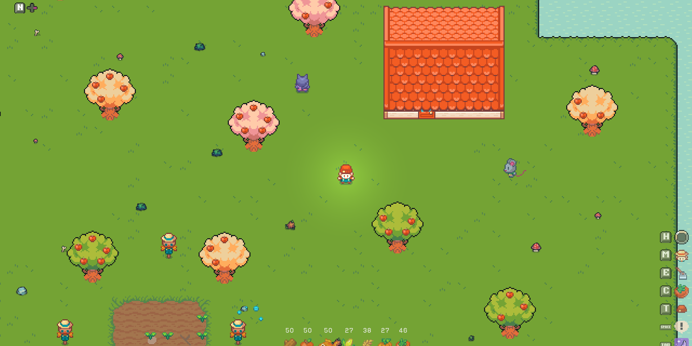
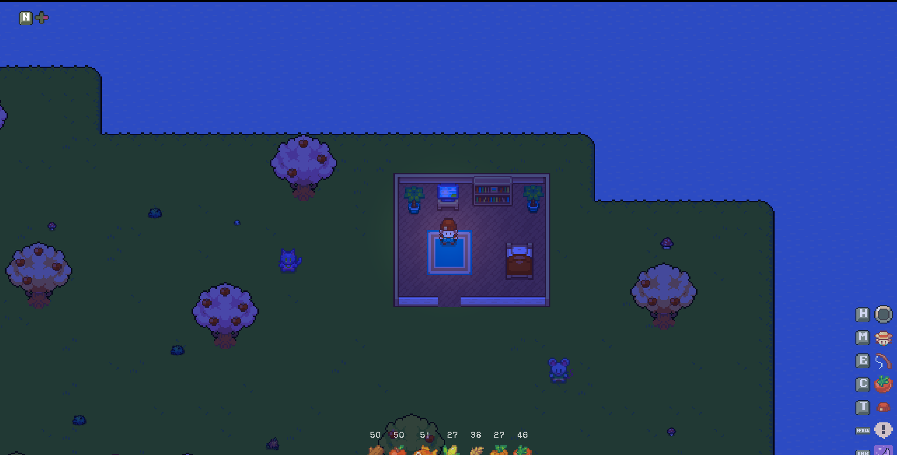
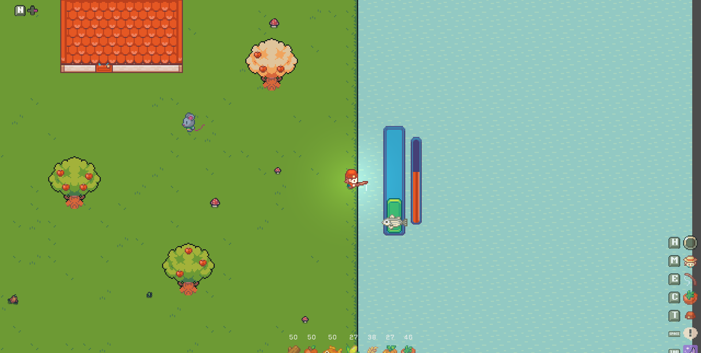
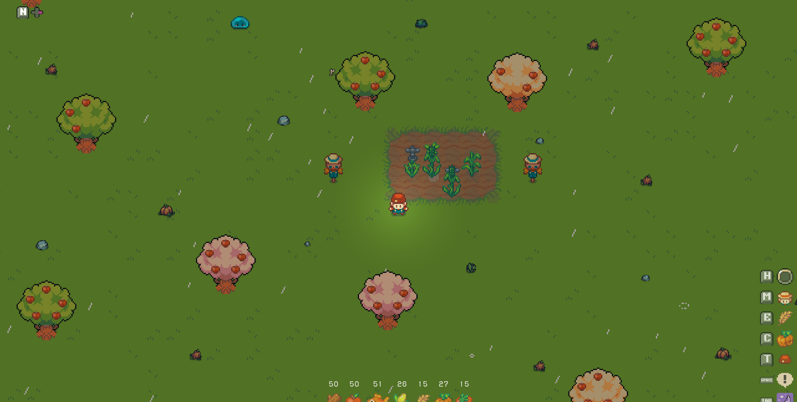
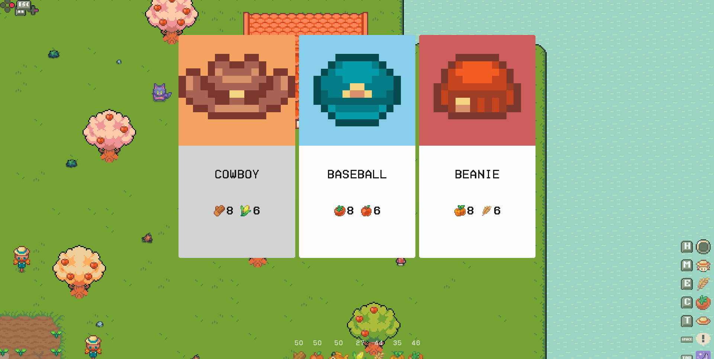

# Godot Valley Course Project

A farming simulation game built by following Kristian Koch's Godot Valley course. The course foundation is complete. Now expanding with additional features.

## Course Status

✅ Course completed  
🚧 Post-course development in progress

## Current Features (from course)

- Player movement with animations
- Farming system (planting, watering, harvesting)
- Fishing mini-game
- Enemy AI (blobs)
- Shop system for upgrades
- Building system (sprinklers, fishers, scarecrows)
- Resource inventory management

## Custom Modifications (already added)

- Hint buttons
- Player pointer highlighter
- Replaced some assets
- etc

# Controls

| Action | Key |
|--------|-----|
| Move | WASD |
| Use Tool | Space |
| Change Tool | E,Q |
| Change Seed | C |
| Change Style | T |
| Build Mode | M |
| Day Change | Tab |
| Highlight Pointer | H |

**Gamepad fully supported!**

## Screenshots

| Day | Night | Fishing |
|:-------:|:-------:|:--------:|
|  | |  |

| Rain | Shop |
|:----:|:------:|
|  |  |

## Planned Features

- Save and Load Game
- Balance Gameplay and Resource

## Links

- [Course on Udemy](https://www.udemy.com/course/recreate-stardew-valley-in-godot/?srsltid=AfmBOorJbCRiX0JZ9wOQuzASJoBd2CyVpifyGZOgPJS1dSdphWNOvNLi)
- [Course Free](https://www.youtube.com/watch?v=jIKuiUdCsuo)
- [Ninja Adventure Asset Pack](https://pixel-boy.itch.io/ninja-adventure-asset-pack)
- [Tiny Swords Asset Pack](https://pixelfrog-assets.itch.io/tiny-swords)
- [Sprout Lands Asset Pack](https://cupnooble.itch.io/sprout-lands-asset-pack)

## Tech Stack

- Godot 4
- GDScript

## Acknowledgments

Course by [Kristian Koch](https://www.udemy.com/user/christian-koch-59/)

## TODOS

- [x] Save/Load System [#7](https://github.com/RezaTaheri01/godot-valley/pull/7)
- [ ] Player Health System
- [ ] Day/Night Cycle Enhancement
- [ ] 3 Map Sizes with Difficulty Tiers
- [ ] Resource & Economy Balance
- [ ] Enemy Area System
- [ ] Tool Upgrade System (Axe/Sword)
- [x] Machine Limitation System [#3](https://github.com/RezaTaheri01/godot-valley/pull/3)
- [ ] Main Menu
- [x] In-Game Menu
- [ ] HUD Improvements
- [ ] Performance Optimization
- [ ] Visual Feedback & Particles

## 🎨 Asset Credits

This project uses assets from the following talented creators and asset packs:

### Ninja Adventure Asset Pack

* **Creator:** [Pixel-boy](https://pixel-boy.itch.io/)
* **Contributors:** [AAA](https://www.instagram.com/challenger.aaa/?hl=fr)
* **Asset Pack:** [Ninja Adventure Asset Pack](https://pixel-boy.itch.io/ninja-adventure-asset-pack)

### Sprout Lands – Basic Pack

* **Creator:** [Cup Nooble](https://cupnooble.itch.io/)
* **Asset Pack:** [Sprout Lands – Basic Pack](https://cupnooble.itch.io/sprout-lands-asset-pack)

### Tiny Swords

* **Creator:** [Pixel Frog](https://pixelfrog-assets.itch.io/)
* **Asset Pack:** [Tiny Swords](https://pixelfrog-assets.itch.io/tiny-swords)

> **Note:** All assets remain the property of their respective creators and are used according to their applicable licenses and terms.

